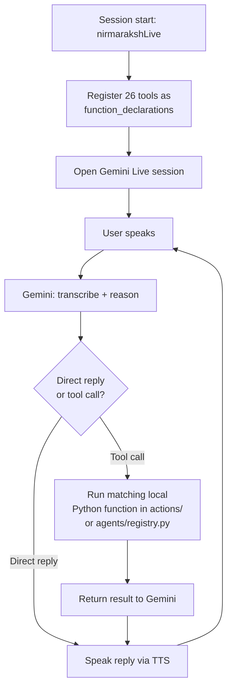
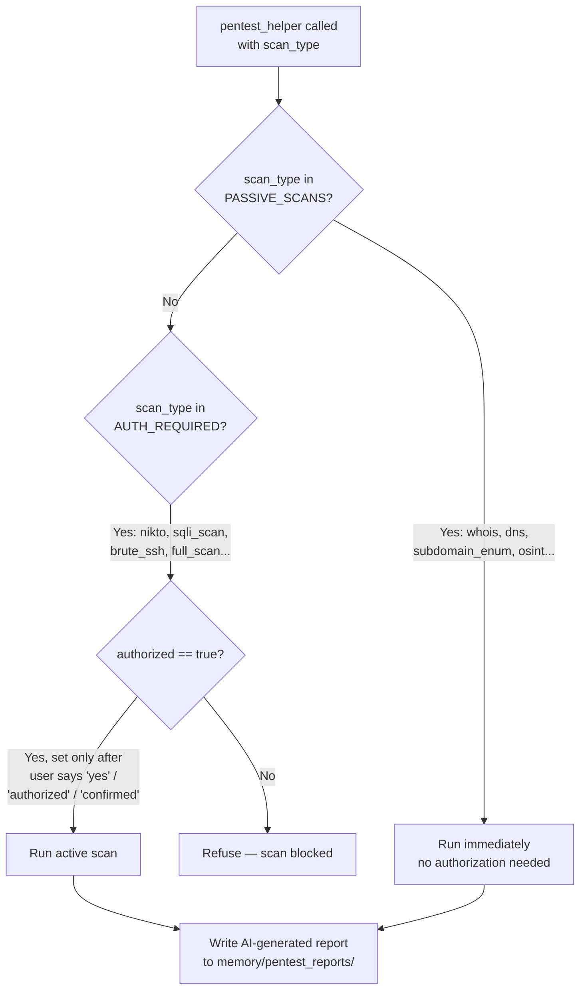
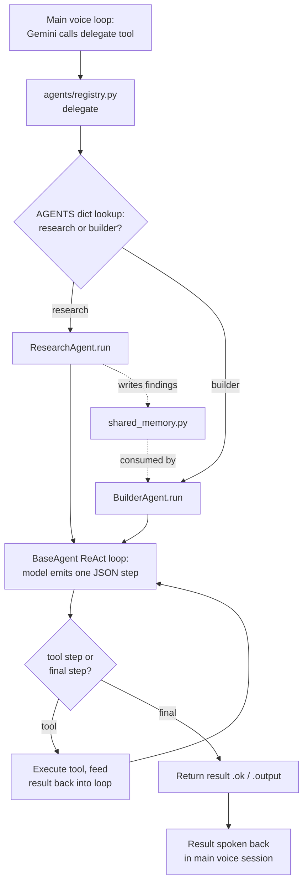

# Nirmaraksh-AI — Technical Documentation

**A voice-controlled desktop AI assistant with real OS-level tool execution, delegated sub-agents, persistent memory, and a companion web frontend.**

---

## 1. What It Is

Nirmaraksh-AI is a desktop assistant built on **PyQt6** that keeps a persistent, realtime voice session open with **Google's Gemini Live API**. Gemini handles speech-to-text, reasoning, tool selection, and text-to-speech in one loop. When it decides an action is needed, it calls one of \~26 registered function tools; the tool executes locally with **real effects on the machine** — not a simulation — and the result is spoken back.

**Stack:** PyQt6 (UI) · Gemini Live API via `google-genai` (primary reasoning/voice loop, native function calling) · Groq (secondary/faster inference) · OpenAI + Anthropic Claude (sub-agent reasoning) · Supabase (auth) · Next.js 16 / React 19 / Tailwind 4 (companion website).

---

## 2. Unique Selling Points

What separates Nirmaraksh-AI from a typical LLM-chat-wrapper hackathon project:

1. **It acts, not just answers.** Most voice-assistant demos end at a spoken reply. Here, the model's output is a function call that executes real, local effects — opening apps, controlling the browser, editing files, managing hardware — through 26 registered tools, not a scripted demo path.
2. **Security scanning with a code-enforced authorization boundary.** `pentest_helper.py` is a genuine 759-line scanning toolkit (port/vuln/SQLi/XSS/CVE scans, brute-force, OSINT), but every active scan is gated by an `authorized` flag checked at every entry point in code — not just instructed in a prompt. Most assistant projects either omit security tooling entirely or leave the authorization boundary as a prompt suggestion that can be talked around; this one can't be.
3. **Self-modifying code with a safety net.** `self_coder.py` lets the assistant rewrite its own source files, but every write is validated, checked against a protected-file list, and backed up first — with a one-command voice undo. Self-editing capability without this is a liability; with it, it's a demonstrable, reversible feature.
4. **Dual-loop agent architecture.** The main assistant runs on Gemini's native function calling for low-latency voice interaction, while delegated multi-step work runs through a separate, provider-agnostic ReAct loop (`BaseAgent`) that works identically on Gemini or Groq. That split — fast native tool-calling for the conversational surface, a portable JSON-protocol loop for deep work — is a deliberate architectural choice, not an accident of using one SDK throughout.
5. **Persistent, silently-written memory.** Identity, routines, and goals are captured into structured categories across sessions without interrupting conversation or requiring the user to explicitly ask to be remembered — closer to how a human assistant builds context over time than a stateless chat session.
6. **Full-stack delivery, not just a script.** A working desktop agent, a Supabase-backed auth and session layer, and a Next.js web frontend with its own SSE-streaming chat backend — end to end, not a single-file prototype.

---

## 3. Repository Layout

```
nirmaraksh-ai/              Desktop app (Python)
  main.py                     Entry point — Gemini Live session, tool registry (~1,544 lines)
  ui.py                       PyQt6 UI (~4,000 lines)
  auth.py / supabase_auth.py  Login UI + Supabase session logic
  agents/                     Sub-agent layer (research, builder)
  actions/                    22 tool modules (OS control, browser, pentest, etc.)
  core/                       STT/TTS, Groq client, system prompt (prompt.txt)
  memory/                     Persistent memory + settings
  config/api_keys.json        API keys + user/app settings
website/nirmaraksh-AI/      Next.js marketing site + web chat demo
backend-nirmaraksh-ai/      Backend architecture doc (Supabase + SSE pipeline)
```

---

## 4. Core Loop (`main.py`)

1. **Session start** — `nirmarakshLive` opens a persistent Gemini Live session.
2. **Tool registration** — every action module, plus the `delegate` sub-agent tool, is registered as a `function_declarations` entry and passed into the session as `tools=[{"function_declarations": TOOL_DECLARATIONS}]`.
3. **Turn** — user speaks → Gemini transcribes and reasons → replies directly or emits a function call.
4. **Execution** — the matching local Python function in `actions/` (or `agents/registry.py` for `delegate`) runs with real side effects.
5. **Result → speech** — the return value goes back to Gemini, which speaks the outcome via TTS.

**Registered tools (26):** `delegate`, `open_app`, `self_code`/`self_code_undo`, `web_search`, `system_status`, `weather_report`, `send_message`, `reminder`, `youtube_video`, `screen_process`/`close_camera`, `computer_settings`, `browser_control`, `file_controller`, `desktop_control`, `code_helper`, `dev_agent`, `computer_control`, `game_updater`, `flight_finder`, `manage_monitor`, `shutdown_nirmaraksh`, `file_processor`, `save_memory`, `pentest_helper`.



---

## 5. System Prompt (`core/prompt.txt`)

45 lines, directly shaping behavior:

- **Identity** — casual, direct tone; no corporate hedging language.
- **One-call policy** — each tool is called exactly once per request; no silent retries.
- **Routing rules** — e.g. `computer_settings` for single OS actions; `delegate` reserved for genuinely multi-step (3+) jobs.
- **Silent memory logging** — detected language, routines, and goals are written via `save_memory` without announcing it to the user.
- **Alert/briefing handling** — `[SYSTEM_ALERT]`, `[STARTUP_BRIEFING]`, `[PROACTIVE_CHECK]`-prefixed messages follow fixed rules (e.g. no tool calls during a proactive check).
- **`pentest_helper` gating** — only invoked after the user explicitly confirms ownership/authorization of the target.

---

## 6. Action Modules (`actions/`, 22 files)

OS/desktop control, browser automation (Playwright), file search/processing, camera + screen vision, hardware monitoring with alerts, reminders, weather, news, flights, YouTube, messaging, game updates, proactive check-ins, coding help, and two modules worth detailing:

**`self_coder.py` — self-editing with undo.** Generates and writes code changes after validation (`_validate_batch`) and a protected-file check (`_is_protected`), backing up the original via `_backup_and_write` before writing. `self_code_undo()` restores the most recent backup set.

**`pentest_helper.py` — authorized security scanning (759 lines).** Port/service/OS/UDP scans, vulnerability-script scans, WHOIS/DNS/subdomain enumeration, OSINT and tech-stack detection, directory enumeration, Nikto, SQLi/XSS/CVE scans, SSH/FTP brute-force, HTTP header and SSL/TLS checks, and an AI-generated final report saved to `memory/pentest_reports/`.

Scans are split into two sets, enforced **in code**, not just by prompt:

```python
AUTH_REQUIRED = {"vuln_script_scan", "nikto", "sqli_scan", "cve_scan",
                  "xss_scan", "brute_ssh", "brute_ftp", "full_scan"}
PASSIVE_SCANS = {"whois", "dns", "subdomain_enum", "osint",
                  "exploit_search", "session_status", "final_report"}
```

Every active-scan entry point (`_run_scan`, `_run_full_scan`, the public handler) checks `scan_type in AUTH_REQUIRED and not authorized` before running. `authorized` is only set `True` after the user's explicit confirmation — this is the module most likely to draw judge scrutiny, and the authorization boundary holding at the code level (not just the prompt level) is the answer to have ready.



---

## 7. Agents (`agents/`)

A delegation layer behind one Gemini-facing tool, `delegate`. `registry.py` defines `AGENTS = {"research": ResearchAgent, "builder": BuilderAgent}` — adding a sub-agent is a one-line addition. `research_agent.py` performs web research and writes findings to `shared_memory.py`; `builder_agent.py` builds a project, consuming the research agent's findings automatically. Both extend `BaseAgent` (`agents/base.py`), which runs an independent ReAct-style loop: each step the model returns one JSON object — `{"thought", "tool", "args"}` to call a tool, or `{"thought", "final"}` to terminate — parsed with a tolerant extractor, with fallback to a secondary LLM provider on repeated malformed output. This loop is provider-agnostic by design, so sub-agent tasks run identically on Gemini or Groq, independent of the main voice loop's native function-calling path.



---

## 8. Memory & Configuration

`memory/memory_manager.py`: `load_memory()`/`save_memory()` persist structured, size-capped memory; `update_memory()` recursively merges updates; `remember()`/`forget()` are category-based helpers (`identity`, `routines`, `goals`, `notes`); `format_memory_for_prompt()` serializes memory into the live prompt context. `memory/config_manager.py` handles settings like the morning-brief toggle.

`config/api_keys.json` mixes secrets and settings in one file: `groq_api_key`, `gemini_api_key`, `openai_api_key`, `claude_api_key`, `supabase_url`, `supabase_anon_key`, `builder_provider`, `os_system`, `assistant_name`, `user_name`, `ui_color`, `morning_brief_enabled`. **Treat as sensitive** — keep real keys out of version control.

Auth is Supabase-based: `auth.py` (PyQt `AuthGate` widget, OAuth via background `QThread`, session restore) + `supabase_auth.py` (session logic).

---

## 9. Website & Backend

`website/nirmaraksh-AI/` — Next.js 16 (App Router), React 19, Tailwind 4, Supabase auth, OpenAI client. Routes for auth, a web chat demo, download, and API handlers; components organized by domain (ui, auth, landing, chat, layout, download).

**Backend (`backend-nirmaraksh-ai/README.md`)** — four-layer system: Next.js client → App Router API → "Nirmaraksh Engine" → Supabase.

- **Auth auto-provisioning** — an `AFTER INSERT` trigger on `auth.users` calls a `SECURITY DEFINER` function provisioning a matching `profiles` row, protected by RLS (`auth.uid() = id`).
- **Realtime streaming chat** — `POST /api/chat` verifies the Supabase session before forwarding to the engine, streaming tokens over SSE at \~25 ms/chunk.
- **Chat persistence** — `demo_messages` with a composite B-tree index on `(user_id, created_at)`, `CHECK` constraint on `role`.
- **Privacy-preserving telemetry** — raw IPs never stored; only a salted SHA-256 hash persists. Profile update + event insert happen atomically inside one `SECURITY DEFINER` RPC.
- **Cascade deletes** — deleting an `auth.users` row cascades to `profiles` and `demo_messages`.

---

## 10. Installation

```bash
cd nirmaraksh-ai
python setup.py   # installs requirements.txt + Playwright browsers
python main.py    # run the assistant
```

Key deps: `PyQt6`, `google-genai`, `sounddevice`, `opencv-python`, `mss`, `psutil`, `playwright`, `groq>=1.7.0`, `anthropic>=0.40.0`, `openai>=1.50.0`; Windows-only extras (`pywin32`, `pycaw`, `win10toast`, `pywinauto`, `comtypes`) gated by `sys_platform == "win32"`.

---

## 11. Key Design Points

1. **Real, not simulated, OS control** — actions genuinely open apps, browse, edit files, and (when authorized) scan network targets.
2. **Security scanning is authorization-gated in code**, checked at every active-scan entry point in `pentest_helper.py`.
3. **Self-modifying code always backs up first**, with a one-command undo.
4. **Tool-call discipline enforced by prompt**: exactly one call per tool per request.
5. **Memory writes are silent and structured** — language, routines, goals captured without interrupting conversation.
6. **Sub-agents are additive by design** — one line per new agent in the `AGENTS` registry; both run a provider-agnostic ReAct loop independent of the main voice session.

---
